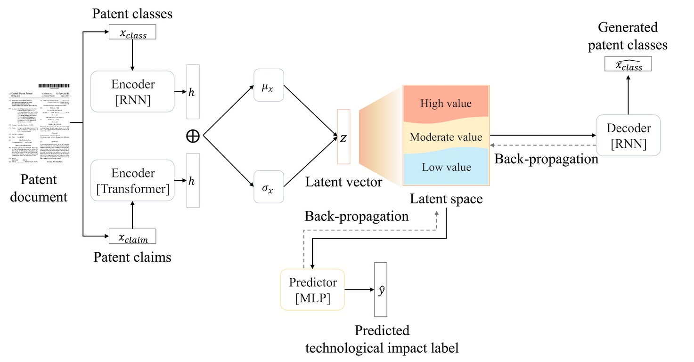

# Technological impact-guided technology opportunity analysis using a generative–predictive machine learning model

[](https://www.apache.org/licenses/LICENSE-2.0)

This repository contains the official implementation of the paper: "**Technological impact-guided technology opportunity analysis using a generative–predictive machine learning model**".


## Introduction
Although patent analysis-based approaches to technology opportunity analysis have proven useful for discovering unexplored technological ideas, identifying opportunities to maximise the potential of existing technologies remains challenging. This study introduces an analytical framework for identifying new technological domains where existing technologies can exhibit greater technological impact. The proposed framework incorporates a generative–predictive machine learning model integrating the variational autoencoder and multi-layer perceptron architectures. The generative and predictive components of this model are jointly trained to construct an impact-centric technology landscape where technologies with similar domains and impacts are closely located. A gradient ascent search algorithm is used to explore this landscape and identify new technological domains that can maximise the potential technological impact of existing technologies.


*Figure 1: Overall workflow of proposed analytical framework*

## Data
- Patent classification codes (CPC) → Technology domains  
- Patent claim texts → Technological functions
- Patent forward citations → Technological impact  
  - Based on the top 10% of forward citations within a technological field, patents are classified as L1 (breakthrough) or L2 (common). 

## Model architecture

Our model integrates a Variational Auto-Encoder (VAE) with a Multilayer Perceptron (MLP):

*   **Generative Component (VAE):** Uses RNNs and a Transformer encoder to map patent classes and claims into a compressed **continuous latent vector ($z$)** and reconstruct the original CPC sequence. This process constructs the **impact-centric technology landscape**.
*   **Predictive Component (MLP):** Takes the latent vector $z$ as input to predict the binary technological impact label (L1/L2 probability).

 The VAE and MLP are **jointly trained** using an integrated loss function that combines reconstruction, regularization (KL divergence), and prediction losses.
  

*Figure 2: Model architecture showing the VAE-MLP structure*

## Identification of technology opportunities - Technology landscape exploration
- After training the generative–predictive integrated model, the structured technology landscape (i.e. impact-centric technology landscape) is explored using a Gradient Ascent Search algorithm.  
- Through this search, new application domains where existing technologies are expected to show greater technological impact are identified as promising technology opportunities. 


*Figure 3: Example of exploration of impact-centric technology landscape*

## Validation of identified technology opportunities
- **Model Reliability Evaluation**  
  - The performance of the model in generating CPC code sets is evaluated using Jaccard similarity.  
  - The predictive performance of technological impact levels is evaluated using Accuracy, Precision, Recall, and F1-score for binary classification.  

- **Model Feasibility Evaluation**  
  - The practicality of the model is assessed by checking its ability to identify new technological domains where existing technologies are likely to achieve greater impact
    - A micro-validation analysis: determine whether the model can identify practical and valuable technology opportunities at the individual patent level using patent citation networks
    - A macro-validation analysis: gauge how the identified opportunities influence broader technology trends by examining impact across a domain-wide group of patents
  

*Figure 4: Overall structure of citation relationships among patents*


## Installation

### Requirements
```bash
# Clone this repository
git clone https://github.com/glee2/TOA-using-generative-predictive-models.git
cd TOA-using-generative-predictive-models

# Install dependencies
pip install -r requirements.txt
```

The main dependencies include:
- PyTorch
- Transformers
- NLTK
- Pandas
- NumPy
- Scikit-learn

## Data preparation
The proposed analytical framework utilizes patent document data sourced from the **[PatentsView database](https://patentsview.org/home)** developed by the USPTO. 

The primary case study covers **133,654 patents related to Artificial Intelligence (AI) technology** granted between 2006 and 2020. The list of AI-related patents can be downloaded from **[AIPD (Artificial Intelligence Patent Dataset)](https://www.uspto.gov/ip-policy/economic-research/research-datasets/artificial-intelligence-patent-dataset)** provided by USPTO.

```bash
# Download and preprocess the patent data
python src/collect_patents.ipynb
```

## Model training

### Configuration
The model's hyperparameters can be configured in the `configs/configs.json` file. We also provide a lightweight model version configuration in the `configs/configs_light.json` file.

### Model Training
```bash
# Train the model with default configurations
python src/main.py --config configs/configs.json --do_train

# For hyperparameter optimization
python src/main.py --config configs/configs.json --do_tune
```


*Figure 4: Training process showing the joint training of VAE and MLP*

## Validation

### Technology opportunity exploration

After training the model, we explore the technology landscape using a Gradient Ascent Search algorithm to identify promising application domains. 

```bash
# Set parameters in the validation notebook
# - Load the trained model
# - Set L1_threshold, n_iter, and step_size
# - Run the exploration algorithm
jupyter notebook src/Validation.ipynb
```

Key parameters:
- `L1_threshold`: Threshold for determining innovative technology (default: 0.8)
- `n_iter`: Number of iterations for gradient ascent (default: 30)
- `step_size`: Step size for gradient ascent (default: 40)

### Micro- and Macro-validation analysis

We evaluate the practicality of our model by verifying whether the domain shifts identified occur in reality and lead to changes in technological impact.

```bash
# Set parameters in the validation notebook
# - After technology opportunity exploration, identify sets of patents and patent classes
# - Compare distribution of forward citations between P_citing/remained and P_citing/shifted
# - Identify breakthrough inventions
# - Obtain descriptive statistics
jupyter notebook src/Validation.ipynb
```

## Citation

If you use this code or find our work useful for your research, please cite our paper:

```
@article{lee2025technological,
  title={Technological impact-guided technology opportunity analysis using a generative–predictive machine learning model},
  author={Lee, Gyumin and others},
  journal={TBD},
  year={TBD},
  publisher={TBD}
}
```

## License

This project is licensed under the Apache License 2.0. See the [LICENSE](https://www.apache.org/licenses/LICENSE-2.0) file for details.

## Contact

For questions or comments, please open an issue or contact the authors directly:
- Gyumin Lee - gyuminlee@dgu.ac.kr